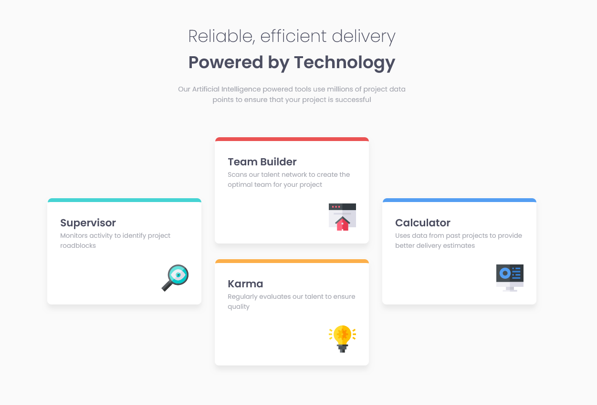
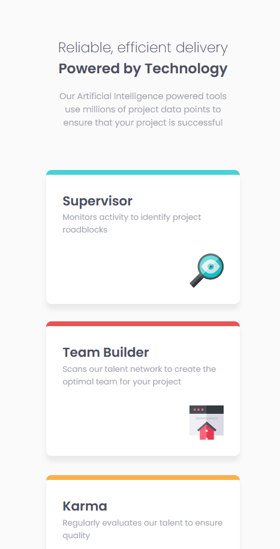

# Frontend Mentor - Four card feature section solution

This is a solution to the [Four card feature section challenge on Frontend Mentor](https://www.frontendmentor.io/challenges/four-card-feature-section-weK1eFYK). Frontend Mentor challenges help you improve your coding skills by building realistic projects. 

## Table of contents

- [Overview](#overview)
  - [The challenge](#the-challenge)
  - [Screenshot](#screenshot)
  - [Links](#links)
- [My process](#my-process)
  - [Built with](#built-with)
  - [What I learned](#what-i-learned)
  - [Continued development](#continued-development)
  - [Useful resources](#useful-resources)
- [Author](#author)
- [Acknowledgments](#acknowledgments)

**Note: Delete this note and update the table of contents based on what sections you keep.**

## Overview

### The challenge

Users should be able to:

- View the optimal layout for the site depending on their device's screen size

### Screenshot

Web design

Mobile design

### Links

- Solution URL: [https://github.com/induwara-thisarindu/four-card-feature-section]
- Live Site URL: [https://four-card-feature-section-fm.netlify.app/]

## My process

I first finished the HTML and then styled it and then desinged it for the mobile desing and I used grid even though I think flexbox was easier I wanted to practice my grid.

### Built with

- Semantic HTML5 markup
- CSS custom properties
- CSS Grid

### What I learned

I think I have a better understanding of grid but not nearly enough

### Useful resources

- I didn't really google much while this project but Traversy media's grid video and kevin's grid video helped me very much. they both are like 30 minutes

"# four-card-feature-section" 
